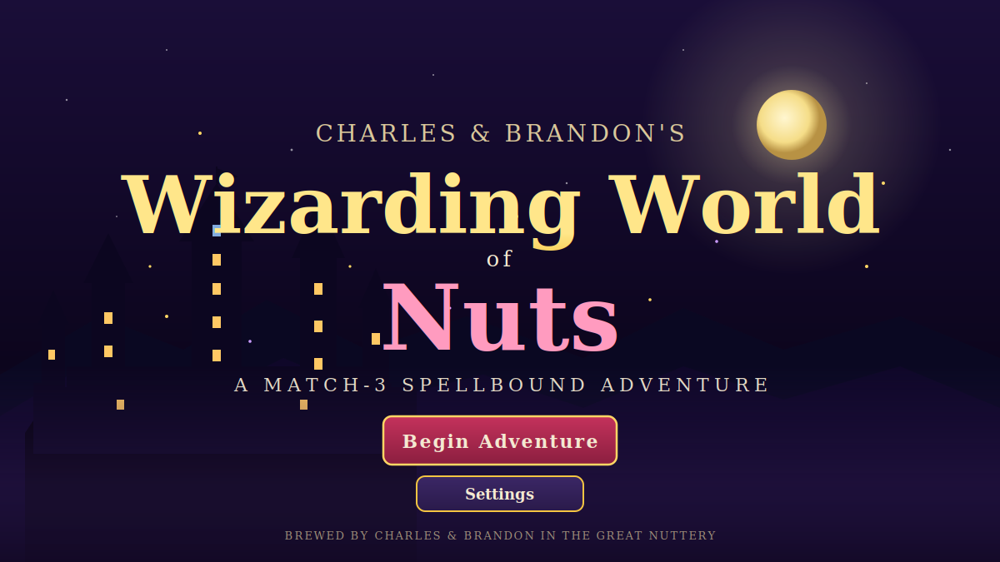
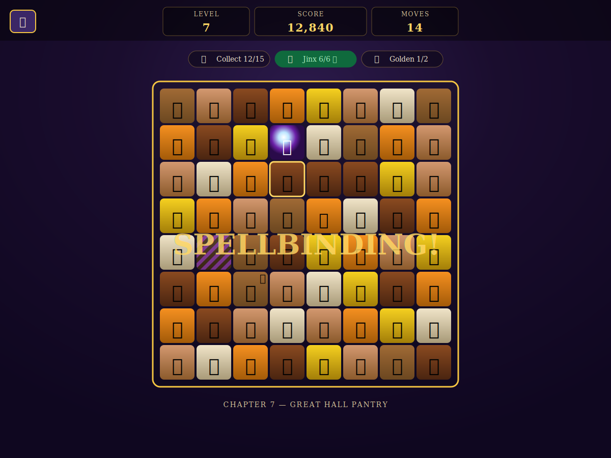
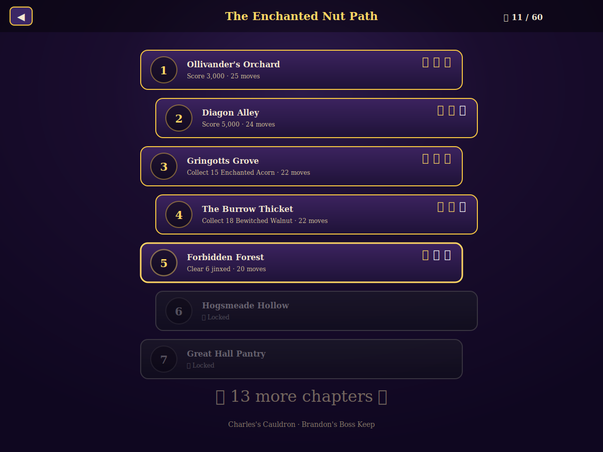

# Charles & Brandon's Wizarding World of Nuts

A spellbound match-3 adventure built in vanilla HTML / CSS / JavaScript. No build step, no dependencies required to play. Ships as a static site, a Progressive Web App (installable to iOS / Android home screens), a Docker container for Unraid, and a Capacitor scaffold for building real Android APKs and iOS apps.



## Quick play

```bash
# Open straight off disk:
open game/index.html

# Or serve locally (recommended for full PWA + audio behaviour):
cd game && python3 -m http.server 8000
# then visit http://localhost:8000
```

## Screenshots

### Gameplay


### Level Map


> Above are SVG preview cards. Replace with real PNG captures any time — drop them at `game/screenshots/<name>.png` and update the README links.

## Features

- **20 hand-crafted levels** along The Enchanted Nut Path, each with star ratings (1–3 ⭐)
- **Four objective types**: score targets, collect-N-of-tile, clear jinxed tiles, drop golden acorns to the bottom row
- **Match-3 engine** with cascading drops, chain combos, and screen shake on big chains
- **Special tiles**: Bombarda (match 4 → row/column clear), Patronus (match 5 → clear all of one colour), Patronus + Patronus → whole-board clear
- **Obstacles**: jinxed tiles (purple-hexed; weakened by adjacent matches), golden acorns (drop to bottom)
- **Polish**: particle bursts, floating score popups, animated combo banner, star-reveal on win
- **Settings**: SFX on/off, music on/off, independent volume sliders
- **Synthesised audio** — every sound and the background music are generated live with Web Audio (no asset files to ship)
- **localStorage save** — stars, best scores, and settings persist
- **Responsive** — desktop + mobile layouts; pointer + touch input
- **PWA**: installable to iOS / Android home screens, works offline after first load

---

## Hosting on Unraid (Docker)

The repo ships with everything you need to run the game in a container.

### Option A — Compose (easiest)

If you have the **Docker Compose Manager** plugin (Community Apps):

1. Clone the repo onto your Unraid box, or copy the files into a stack folder.
2. Run:
   ```bash
   docker compose up -d --build
   ```
3. Visit `http://<unraid-ip>:8080`

The `docker-compose.yml` exposes port `8080` on the host. Change the left side of `"8080:80"` if you want a different port.

### Option B — Unraid Docker tab template

1. Build and push the image to a registry (one time):
   ```bash
   docker build -t YOURDOCKERHUB/wizarding-nuts:latest .
   docker push YOURDOCKERHUB/wizarding-nuts:latest
   ```
2. Edit `deploy/unraid-template.xml` and replace `yourname/wizarding-nuts:latest` with your repository.
3. Copy the file to your Unraid server at `/boot/config/plugins/dockerMan/templates-user/`.
4. Open the Docker tab → **Add Container** → choose **Wizarding-Nuts**.
5. Pick a port and hit Apply.

### Option C — Pure Docker

```bash
docker build -t wizarding-nuts .
docker run -d --name wizarding-nuts -p 8080:80 --restart unless-stopped wizarding-nuts
```

The container is **stateless** — no volumes needed. All save data lives in the player's browser via `localStorage`.

---

## Cross-platform: iOS & Android

The game is a PWA out of the box, so the **easiest cross-platform path** is "Add to Home Screen."

### Path 1 — PWA (zero extra work)

After hosting the site on your Unraid box (or anywhere with HTTPS):

- **iOS / iPadOS**: open the URL in **Safari** → tap Share → **Add to Home Screen**. Launches fullscreen, no browser chrome, custom icon, works offline.
- **Android (Chrome / Edge / Brave)**: open the URL → menu → **Install app**. Lands as a real launcher icon, fullscreen.
- **Desktop (Chrome / Edge)**: install icon appears in the address bar.

This is the recommended path because:
- No app store review
- Updates ship instantly (just push new files; the service worker picks them up)
- Works on iOS without a Mac or Apple Developer account
- Works on Android without Google Play

> **Note for iOS:** PWAs only get the full home-screen install experience from Safari (not Chrome on iOS). The site must be served over **HTTPS** on a real domain (or `localhost` for testing) — plain `http://192.168.x.x` will not let you install. Easiest options on Unraid: SWAG / NPM (Nginx Proxy Manager) reverse proxy with a Let's Encrypt cert.

### Path 2 — Real Android APK (Capacitor)

If you want a sideloadable `.apk` (or to publish to the Play Store), the repo includes a Capacitor scaffold.

**One-time setup on your dev machine:**
- Install [Node.js 18+](https://nodejs.org)
- Install [Java 17 (Temurin)](https://adoptium.net)
- Install [Android Studio](https://developer.android.com/studio) and let it install the SDK
- Set `$ANDROID_HOME` to the SDK path (Android Studio shows it under Settings → Languages & Frameworks → Android SDK)

**Build the APK:**

```bash
npm install            # one-time
npm run build:apk      # builds android/app/build/outputs/apk/debug/app-debug.apk
```

The script handles `cap add android`, `cap sync`, and `gradlew assembleDebug`. Sideload onto a phone with:

```bash
adb install -r android/app/build/outputs/apk/debug/app-debug.apk
```

For a release / signed APK or AAB for the Play Store, open the project in Android Studio:

```bash
npm run cap:open-android
```

…and use **Build → Generate Signed Bundle / APK**.

### Path 3 — iOS .ipa (Capacitor, requires a Mac)

Apple's tooling only runs on macOS, so this path needs a Mac with Xcode installed.

```bash
npm install
npm run cap:add-ios
npm run cap:open-ios
```

That opens Xcode. From there you can run on a simulator, sideload onto a connected device (free Apple ID lasts 7 days), or archive for the App Store ($99/year Apple Developer account).

---

## File layout

```
.
├── game/                          # The web app (everything you need to host)
│   ├── index.html
│   ├── styles.css
│   ├── textures.js                # The ONE file you edit to re-skin tiles
│   ├── levels.js                  # Level definitions
│   ├── audio.js                   # WebAudio-synthesised SFX + music
│   ├── game.js                    # Match-3 engine
│   ├── ui.js                      # Screens, modals, HUD
│   ├── main.js                    # State machine + save/load + SW registration
│   ├── manifest.webmanifest       # PWA manifest
│   ├── sw.js                      # Service worker (offline cache)
│   ├── icons/                     # App icons (192/512 PNG, maskable, apple-touch, favicons)
│   ├── assets/                    # Drop tile images here (optional)
│   └── screenshots/               # README preview images
│
├── Dockerfile                     # nginx:alpine + the game/ directory
├── docker-compose.yml             # One-command run for Unraid
├── deploy/
│   ├── nginx.conf                 # PWA-aware nginx config
│   └── unraid-template.xml        # Unraid Docker tab template
│
├── package.json                   # Capacitor deps + npm scripts
├── capacitor.config.json          # Capacitor app config
└── scripts/
    └── build-android.sh           # One-shot APK builder
```

## Re-skinning the game

Open `game/textures.js`. Each tile is a single object:

```js
{
  id: 'acorn',
  label: 'Enchanted Acorn',
  glyph: '🌰',                  // fallback if image is missing
  image: 'assets/acorn.png',    // preferred when present
  color: '#8b5a2b',             // background tint
  bg:    '#3a2416',             // contrast rim
}
```

To re-skin: drop a square transparent PNG (128×128 or larger) into `game/assets/`, set its path on `image`, reload. The engine prefers `image` and silently falls back to `glyph` if the file fails to load.

`NUTS.branding` at the bottom of the same file controls the title, tagline, and chapter prefix shown in-game.

## Adding levels

Append to the `NUTS.levels` array in `game/levels.js`:

```js
{
  id: 21,
  name: "New Chapter Name",
  moves: 22,
  scoreStars: [10000, 18000, 28000],
  objectives: [
    { type: 'score',   target: 10000 },
    { type: 'collect', tile: 'pecan', count: 20 },
    { type: 'jinx',    count: 8 },
    { type: 'golden',  count: 3 },
  ],
  jinxSeeds: 8,
  goldenSeeds: 3,
}
```

## Controls

- **Click / tap** a tile to select, then click an adjacent tile to swap
- **Pause** button → settings, quit to map, or resume
- **Reset Progress** on the title screen wipes stars and best scores

## Credits

Brewed by **Charles & Brandon** in the Great Nuttery.
